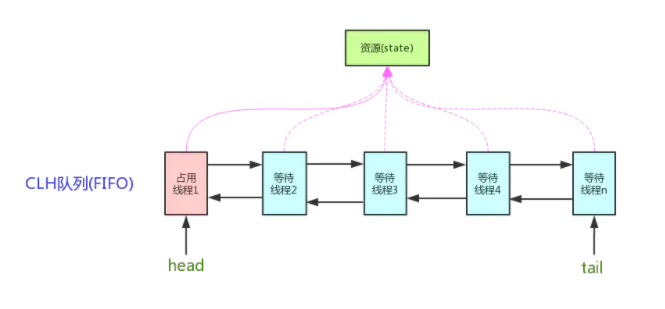
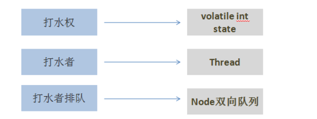
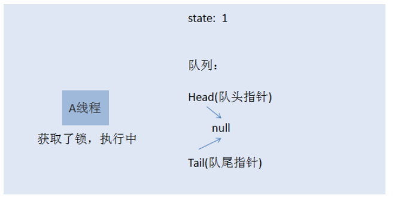
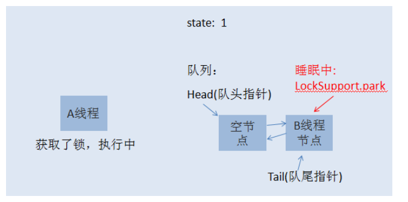
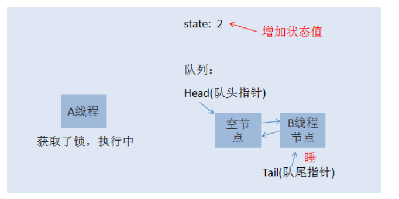
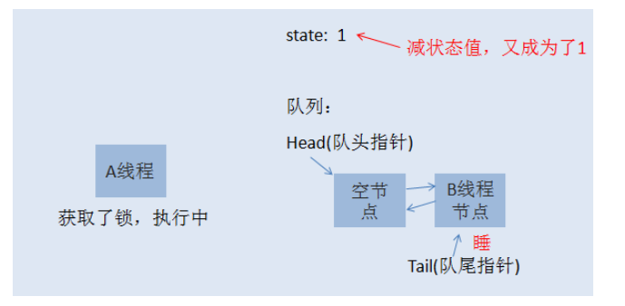

###CAS(CompareAndSwap) + AQS(AbstractQueuedSynchronized)
Lock接口有三个实现类：
一个是ReentrantLock,另两个是ReentrantReadWriteLock类中的两个静态内部类ReadLock和WriteLock。

AQS的两种功能
从使用层面来说，AQS的功能分为两种：独占和共享
- 独占锁，每次只能有一个线程持有锁，比如前面给大家演示的ReentrantLock就是以独占方式实现的互斥锁
- 共享锁，允许多个线程同时获取锁，并发访问共享资源，比如ReentrantReadWriteLock

需要实现锁的功能，两个必备元素:
- 一个是表示（锁）状态的变量（我们假设0表示没有线程获取锁，1表示已有线程占有锁）,该变量必须声明为volatile类型;
- 另一个是队列，队列中的节点表示因未能获取锁而阻塞的线程。



###获取锁原理举例子###
ReentrantLock支持两种获取锁的方式，一种是公平模型，一种是非公平模型。在继续之前，咱们先把故事元素转换为程序元素。


咱们先来说说[公平锁模型]：
初始化时， state=0，表示无人抢占了打水权。这时候，村民A来打水(A线程请求锁),占了打水权,把state+1,如下所示：  


线程A取得了锁，把 state原子性+1,这时候state被改为1，A线程继续执行其他任务，然后来了村民B也想打水（线程B请求锁），
线程B无法获取锁，生成节点进行排队，如下图所示：


初始化的时候，会生成一个空的头节点，然后才是B线程节点，这时候，如果线程A又请求锁，是否需要排队？
答案当然是否定的，否则就直接死锁了。当A再次请求锁，就相当于是打水期间，同一家人也来打水了，是有特权的，这时候的状态如下图所示：


[到了这里，相信大家应该明白了什么是可重入锁了吧。就是一个线程在获取了锁之后，再次去获取了同一个锁，]
这时候仅仅是把状态值进行累加。如果线程A释放了一次锁，就成这样了：


仅仅是把状态值减了，只有线程A把此锁全部释放了，状态值减到0了，其他线程才有机会获取锁。当A把锁完全释放后，state恢复为0，
然后会通知队列唤醒B线程节点，使B可以再次竞争锁。当然，如果B线程后面还有C线程，C线程继续休眠，除非B执行完了，
通知了C线程。注意，当一个线程节点被唤醒然后取得了锁，对应节点会从队列中删除。

- [非公平锁模型]
如果你已经明白了前面讲的公平锁模型，那么非公平锁模型也就非常容易理解了。当线程A执行完之后，要唤醒线程B是需要时间的，
而且线程B醒来后还要再次竞争锁，所以如果在切换过程当中，来了一个线程C，那么线程C是有可能获取到锁的，如果C获取到了锁，
B就只能继续乖乖休眠了。这里就不再画图说明了。 

# 可重入锁
如果锁具备可重入性，则称作为可重入锁。像synchronized和ReentrantLock都是可重入锁，可重入性在我看来实际上表明了锁的分配机制：
基于线程的分配，而不是基于方法调用的分配。举个简单的例子，当一个线程执行到某个synchronized方法时，
比如说method1，而在method1中会调用另外一个synchronized方法method2，此时线程不必重新去申请锁，而是可以直接执行方法method2。
看下面这段代码就明白了：
```java
class MyClass {
    public synchronized void method1() {
        method2();
    }
      
    public synchronized void method2() {
          
    }
}
```
上述代码中的两个方法method1和method2都用synchronized修饰了，
假如某一时刻，线程A执行到了method1，此时线程A获取了这个对象的锁，而由于method2也是synchronized方法，
假如synchronized不具备可重入性，此时线程A需要重新申请锁。但是这就会造成一个问题，因为线程A已经持有了该对象的锁，
而又在申请获取该对象的锁，这样就会线程A一直等待永远不会获取到的锁。

而由于synchronized和Lock都具备可重入性，所以不会发生上述现象。

接下来，开始真正的源码分析：
```
public ReentrantLock(boolean fair) {
    sync = fair ? new FairSync() : new NonfairSync();
}

//ReentrantLock的构造方法，现在只看公平锁。FairSync的实现

static final class FairSync extends Sync {
        private static final long serialVersionUID = -3000897897090466540L;
 
        final void lock() {
            acquire(1);
        }
 
        /**
         * Fair version of tryAcquire.  Don't grant access unless
         * recursive call or no waiters or is first.
         */
        protected final boolean tryAcquire(int acquires) {
            final Thread current = Thread.currentThread();
            int c = getState();
            if (c == 0) {
                if (!hasQueuedPredecessors() &&
                    compareAndSetState(0, acquires)) {
                    setExclusiveOwnerThread(current);
                    return true;
                }
            }
            else if (current == getExclusiveOwnerThread()) {
                int nextc = c + acquires;
                if (nextc < 0)
                    throw new Error("Maximum lock count exceeded");
                setState(nextc);
                return true;
            }
            return false;
        }
    }
```
当调用lock方法时，会调用acquire（1）方法，获取state，state等于0表示没有线程获取到锁，接下来会判断是否有等待的线程，
如果没有等待线程和进行cas操作state成功，则设置当前独占线程为当前线程，返回true，获取锁成功。
后面有个else条件就是可重入锁的实现，如果获取锁失败，则判断当前独占锁线程是否为当前线程
，如果是当前线程，则将state进行加一操作，并返回true，获取锁成功。否则获取锁失败。

注意事项：state 使用了volatile关键字，使state被线程修改时，及时的被其他线程读取到最新的值。
```
AbstractQueuedSynchronizer

public final void acquire(int arg) {
    if (!tryAcquire(arg) &&
        acquireQueued(addWaiter(Node.EXCLUSIVE), arg))
        selfInterrupt();
}
```

尝试获取锁，当获取锁失败后，将当前线程放入等待队列中，然后开始循环去获取锁操作。
```
final boolean acquireQueued(final Node node, int arg) {
    boolean failed = true;
    try {
        boolean interrupted = false;
        for (;;) {
            final Node p = node.predecessor();
            if (p == head && tryAcquire(arg)) {
                setHead(node);
                p.next = null; // help GC
                failed = false;
                return interrupted;
            }
            if (shouldParkAfterFailedAcquire(p, node) &&
                parkAndCheckInterrupt())
                interrupted = true;
        }
    } finally {
        if (failed)
            cancelAcquire(node);
    }
}
```
如果已经没有线程获取锁的时候，则返回true，当前锁线程进行interrupt操作，