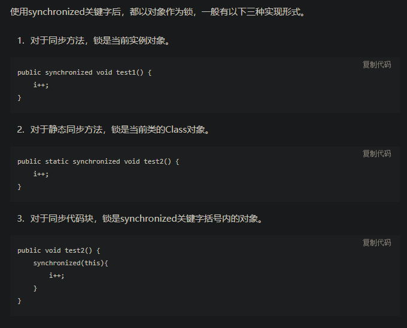
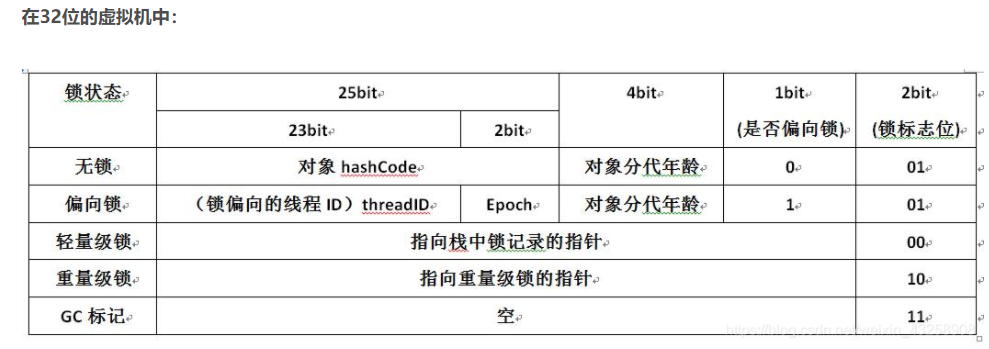
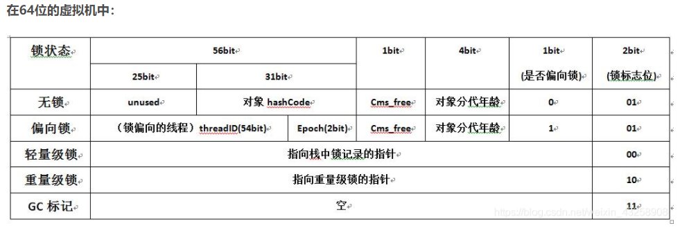
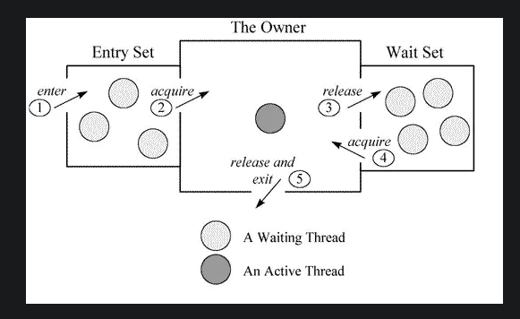
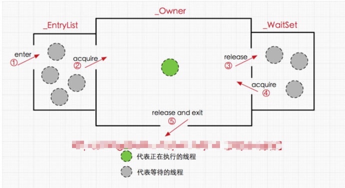

# [锁对象]和[锁Class]实现原理是一样的；都是monitor，
# 二者的区别就是对象可以有多份，而Class只有一份



Java 虚拟机中的同步(Synchronization)基于进入和退出管程(Monitor)对象实现，
无论是显式同步(有明确的 monitorenter 和 monitorexit 指令,即同步代码块)还是隐式同步都是如此。
在 Java 语言中，同步用的最多的地方可能是被 synchronized 修饰的同步方法。同步方法并不是由 monitorenter 和 monitorexit 指令来实现同步的，
而是由方法调用指令读取运行时常量池中方法的 ACC_SYNCHRONIZED 标志来隐式实现的。

锁是加在对象上的，无论是类对象还是实例对象。每个对象主要由一个对象头、实例变量、填充数据三部分组成，结构如图：


synchronized使用的锁对象是存储在Java对象头里的,
jvm中采用2个字来存储对象头(如果对象是数组则会分配3个字，多出来的1个字记录的是数组长度)，
其主要结构是由Mark Word 和 Class Metadata Address 组成，其结构说明如下：

由于对象头的信息是与对象自身定义的数据没有关系的额外存储成本，因此考虑到JVM的空间效率，Mark Word 被设计成为一个非固定的数据结构，
以便存储更多有效的数据，它会根据对象本身的状态复用自己的存储空间，如32位JVM下，除了上述列出的Mark Word默认存储结构外，还有如下可能变化的结构：


synchronized属于结构中的重量级锁，锁标识位为10，其中指针指向的是monitor对象的起始地址。
每个对象都存在着一个 monitor 与之关联，对象与其 monitor 之间的关系有存在多种实现方式，
如monitor可以与对象一起创建销毁或当线程试图获取对象锁时自动生成，但当一个 monitor 被某个线程持有后，它便处于锁定状态。
在Java虚拟机(HotSpot)中，monitor是由ObjectMonitor实现的，其主要数据结构如下（位于HotSpot虚拟机源码ObjectMonitor.hpp文件，C++实现的）。

这边也就主要分析一下重量级锁，标志位为10，指针指向monitor对象的起始地址，
而每一个对象都存在着一个monitor与之关联。在Hot Spot中，monitor是由ObjectMonitor类来实现的。
先来看一下ObjectMonitor的数据结构。
```C
ObjectMonitor() {
    _header       = NULL;//markOop对象头
    _count        = 0;
    _waiters      = 0,//等待线程数
    _recursions   = 0;//重入次数
    _object       = NULL;//监视器锁寄生的对象。锁不是平白出现的，而是寄托存储于对象中。
    _owner        = NULL;//指向获得ObjectMonitor对象的线程或基础锁
    _WaitSet      = NULL;//处于wait状态的线程，会被加入到waitSet；
    _WaitSetLock  = 0;
    _Responsible  = NULL;
    _succ         = NULL;
    _cxq          = NULL;
    FreeNext      = NULL;
    _EntryList    = NULL;//处于等待锁block状态的线程，会被加入到entryList；
    _SpinFreq     = 0;
    _SpinClock    = 0;
    OwnerIsThread = 0;
    _previous_owner_tid = 0;//监视器前一个拥有者线程的ID
}
```
  
结构中几个重要的字段要关注：_count、_owner、_EntryList、_WaitSet。

- 1.count用来记录线程进入加锁代码的次数。
- 2.owner记录当前持有锁的线程,即持有ObjectMonitor对象的线程。
- 3.EntryList是想要持有锁的线程的集合。
- 4.WaitSet 是加锁对象调用wait()方法后，等待被唤醒的线程的集合。
- 5._recursions是锁重入次数

其中有两个队列 _EntryList和 _WaitSet，它们是用来保存ObjectMonitor对象列表， 
_owner指向持有ObjectMonitor对象的线程。
当多个线程访问同步代码时，线程会进入_EntryList区，
当线程获取对象的monitor后(对于线程获得锁的优先级，还有待考究)
进入 _Owner区并且将 _owner指向获得锁的线程(monitor对象被线程持有)，
_count++，其他线程则继续在 _EntryList区等待。若线程调用wait方法，
则该线程进入 _WaitSet区等待被唤醒。线程执行完后释放monitor锁并且对ObjectMonitor中的值进行复位。
上面说到synchronized使用的锁都放在对象头里，大概指的就是Mark Word中指向互斥量的指针指向的monitor对象内存地址了。
由以上可知为什么Java中每一个对象都可以作为锁对象了。


每个等待锁的线程都会被封装成ObjectWaiter对象，当多个线程同时访问一段同步代码（临界区）时，首先会进入 _EntryList 集合，
当线程获取到对象的monitor 后进入 _Owner 区域并把monitor中的owner变量设置为当前线程，_owner指向持有ObjectMonitor对象的线程。同时monitor中的计数器count加1。

若线程调用 wait() 方法，将释放当前持有的monitor，owner变量恢复为null，count自减1，同时该线程进入 WaitSet集合中等待被唤醒。
若当前线程执行完毕也将释放monitor并复位变量的值，以便其他线程进入获取monitor(锁)。


#Synchronized与等待唤醒
等待唤醒是指调用对象的wait、notify、notifyAll方法。调用这三个方法时，对象必须被synchronized修饰，因为这三个方法在执行时，
必须获得当前对象的监视器monitor对象。

另外，与sleep方法不同的是wait方法调用完成后，线程将被暂停，但wait方法将会释放当前持有的监视器锁(monitor)，
直到有线程调用notify/notifyAll方法后方能继续执行。而sleep方法只让线程休眠并不释放锁。notify/notifyAll方法调用后，
并不会马上释放监视器锁，而是在相应的synchronized代码块或synchronized方法执行结束后才自动释放锁。

#Synchronized的可重入与中断
- 重入
当多个线程请求同一个临界资源，执行到同一个临界区时会产生互斥，未获得资源的线程会阻塞。而当一个已获得临界资源的线程再次请求此资源时并不会发生阻塞，
仍能获取到资源、进入临界区，这就是重入。Synchronized是可重入的。

- 中断
在Thread类中与线程中断相关的方法有三个：
```java
/**
 * Interrupt设置一个线程为中断状态
 * Interrupt操作的线程处于sleep,wait,join 阻塞等状态的时候，清除“中断”状态，抛出一个InterruptedException
 * Interrupt操作的线程在可中断通道上因调用某个阻塞的 I/O 操作(serverSocketChannel. accept()、socketChannel.connect、socketChannel.open、 
 * socketChannel.read、socketChannel.write、fileChannel.read、fileChannel.write)，会抛出一个ClosedByInterruptException
 **/
public void interrupt();
/**
 * 判断线程是否处于“中断”状态，然后将“中断”状态清除
 **/
public static boolean interrupted();
/**
 * 判断线程是否处于“中断”状态
 **/
public boolean isInterrupted();
```

在实际使用中，当线程正处于调用sleep、wait、join方法后，调用interrupt会清除线程中断状态，并抛出异常。而当线程已进入临界区、正在执行，
则需要isInterrupted()或interrupted()与interrupt()配合使用中断执行中的线程。

Synchronized修饰的方法、代码块被多个线程请求时，调用中断。正在执行的线程响应中断。
正在阻塞的线程、执行中的线程都会标记中断状态，但阻塞的线程不会立刻处理中断，而是在进入临界区后再响应。

示例：中断对执行synchronized方法线程的影响
```java
import java.util.concurrent.TimeUnit;

/**
 * 示例：中断对执行synchronized方法线程的影响
 * 正在执行的线程响应中断
 * 正在阻塞的线程、执行中的线程都会标记中断状态，
 * 但阻塞的线程不会立刻处理中断，而是在进入临界区后再响应。
 */
public class SyncDemo3 {
    public static boolean flag = true;

    public static synchronized void m1() {
        System.out.println(Thread.currentThread().getName() + " hold resource!");
        while (flag) {
            if (!Thread.currentThread().isInterrupted()) {
                //不用sleep，因为sleep会对中断抛出异常
                Thread.yield();
            } else {
                System.out.println(Thread.currentThread().getName() + " interrupted and release !");
                return;
            }
        }
    }

    public static void main(String[] args) {
        SyncDemo3 syncDemo1 = new SyncDemo3();
        SyncDemo3 syncDemo2 = new SyncDemo3();
        //启动两个线程
        Thread thread1 = new Thread(new ThreadDemo3(syncDemo1), "thread1");
        Thread thread2 = new Thread(new ThreadDemo3(syncDemo2), "thread2");
        thread1.start();
        //休眠1秒，让thread1获取资源
        try {
            TimeUnit.SECONDS.sleep(1);
        } catch (InterruptedException e) {
            e.printStackTrace();
        }

        thread2.start();
        //休眠1秒
        try {
            TimeUnit.SECONDS.sleep(1);
        } catch (InterruptedException e) {
            e.printStackTrace();
        }
        //thread1中断
        thread1.interrupt();
        //thread2中断
        thread2.interrupt();

        if (thread1.isInterrupted()) {
            System.out.println("thread1 interrupt!");
        }
        if (thread2.isInterrupted()) {
            System.out.println("thread2 interrupt!");
        }

        //休眠1秒，让thread2获取资源
        try {
            TimeUnit.SECONDS.sleep(1);
        } catch (InterruptedException e) {
            e.printStackTrace();
        }


    }
}

class ThreadDemo3 implements Runnable {
    SyncDemo3 syncDemo3;

    public ThreadDemo3(SyncDemo3 syncDemo3) {
        this.syncDemo3 = syncDemo3;
    }

    @Override
    public void run() {
        syncDemo3.m1();
    }
}
```

# JDK6对Synchronized的优化
在JDK6以前synchronized的性能并不高，但在之后进行了优化，我们在之前的Mark Word的结构中可以看到，
锁的状态总共有四种，无锁状态、偏向锁、轻量级锁和重量级锁。随着锁的竞争，锁可以从偏向锁升级到轻量级锁，
再升级的重量级锁，[锁可以升级，也可以降级]

>偏向锁

偏向锁是Java 6之后加入的新锁，它是一种针对加锁操作的优化手段。经过研究发现，在大多数情况下，锁不仅不存在多线程竞争，
而且总是由同一线程多次获得，因此为了减少同一线程获取锁(会涉及到一些CAS操作,耗时)的代价而引入偏向锁。
偏向锁的核心思想是，如果一个线程获得了锁，那么锁就进入偏向模式，此时Mark Word 的结构也变为偏向锁结构，当这个线程再次请求锁时，
无需再做任何同步操作，即获取锁的过程，这样就省去了大量有关锁申请的操作，从而也就提供程序的性能。
所以，对于没有锁竞争的场合，偏向锁有很好的优化效果，毕竟极有可能连续多次是同一个线程申请相同的锁。
但是对于锁竞争比较激烈的场合，偏向锁就失效了，因为这样场合极有可能每次申请锁的线程都是不相同的，
因此这种场合下不应该使用偏向锁，否则会得不偿失。但偏向锁失败后，并不会立即膨胀为重量级锁，而是先升级为轻量级锁。

>轻量级锁

若偏向锁失败，虚拟机并不会立即升级为重量级锁，它还会尝试使用一种称为轻量级锁的优化手段，此时Mark Word 的结构也变为轻量级锁的结构。
轻量级锁能够提升程序性能的依据是“对绝大部分的锁，在整个同步周期内都不存在竞争”，注意这是经验数据。
需要了解的是，轻量级锁所适应的场景是线程交替执行同步块的场合，如果存在同一时间访问同一锁的场合，就会导致轻量级锁膨胀为重量级锁。

>自旋锁(Adaptive Spinning)

轻量级锁失败后，虚拟机为了避免线程真实地在操作系统层面挂起，还会进行一项称为自旋锁的优化手段。
这是基于在大多数情况下，线程持有锁的时间都不会太长，如果直接挂起操作系统层面的线程可能会得不偿失，
毕竟操作系统实现线程之间的切换时需要从用户态转换到核心态，这个状态之间的转换需要相对比较长的时间，
时间成本相对较高，因此自旋锁会假设在不久将来，当前的线程可以获得锁，因此虚拟机会让当前想要获取锁的线程做几个空循环(这也是称为自旋的原因)，
一般不会太久，可能是50个循环或100循环，在经过若干次循环后，如果得到锁，就顺利进入临界区。如果还不能获得锁，
那就会将线程在操作系统层面挂起，这就是自旋锁的优化方式，这种方式确实也是可以提升效率的。最后没办法也就只能升级为重量级锁了。

>锁消除(Lock Elimination)

消除锁是虚拟机另外一种锁的优化，这种优化更彻底，Java虚拟机在JIT编译时(可以简单理解为当某段代码即将第一次被执行时进行编译，又称即时编译)，
通过对运行上下文的扫描，去除不可能存在共享资源竞争的锁，通过这种方式消除没有必要的锁，可以节省毫无意义的请求锁时间。

>锁粗化(Lock Coarsening)

如果虚拟机探测到有这样一串零碎的操作都对同一个对象加锁，将会把加锁同步的范围扩展到整个操作序列的外部，这样就只需要加锁一次就够了。