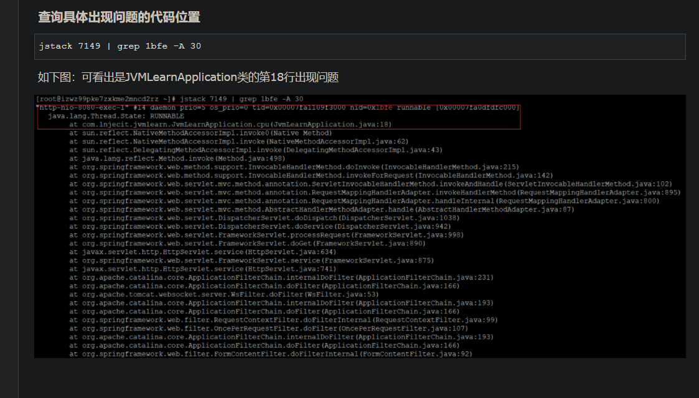

#第一步： top命令
>查看占用CPU最高的java程序,并且拿到对应进程的pid

#第二步： top -H -p [进程pid] 
>查看该进程pid下的所有线程,找到占用CPU最高的线程,并记录下该[线程的pid]

#第三步： printf "%x \n" [线程pid]
>得到16进制的线程pid

#第四步： jstack [进程pid] | grep [线程pid的16进制] -A 30 
>便可以看到那句代码出现问题了

