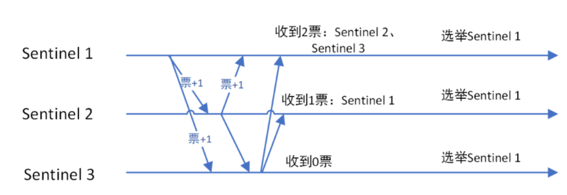
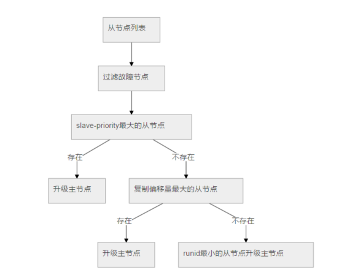

quorum:是一个数字，指明当有多少个sentinel认为一个master失效时，master才算真正失效

#概要
当redis集群的[主节点]故障时，Sentinel集群将从剩余的从节点中选举一个新的主节点，有以下步骤：
- 1.故障节点主观下线
- 2.故障节点客观下线
- 3.Sentinel集群选举Leader
- 4.Sentinel Leader决定新主节点

>选举过程
#1.主观下线
Sentinel集群的每一个Sentinel节点会定时对redis集群的所有节点发心跳包检测节点是否正常。
如果一个节点在down-after-milliseconds时间内没有回复Sentinel节点的心跳包，则该redis节点被该Sentinel节点主观下线。

#2.客观下线
当节点被一个Sentinel节点记为主观下线时，并不意味着该节点肯定故障了，还需要Sentinel集群的其他Sentinel节点共同判断为主观下线才行。
该Sentinel节点会询问其他Sentinel节点，如果Sentinel集群中超过quorum数量的Sentinel节点认为该redis节点主观下线，则该redis客观下线。
如果客观下线的redis节点是从节点或者是Sentinel节点，则操作到此为止，没有后续的操作了；
如果客观下线的redis节点为主节点，则开始故障转移，从从节点中选举一个节点升级为主节点。

#3.Sentinel集群选举Leader
[如果需要从redis集群选举一个节点为主节点，首先需要从Sentinel集群中选举一个Sentinel节点作为Leader。]
每一个Sentinel节点都可以成为Leader，当一个Sentinel节点确认redis集群的主节点主观下线后，会请求其他Sentinel节点要求将自己选举为Leader。
被请求的Sentinel节点如果没有同意过其他Sentinel节点的选举请求，则同意该请求(请求者选举票数会+1)，否则不同意。
如果一个Sentinel节点获得的选举票数达到Leader最低票数([quorum]和[Sentinel节点数/2+1的最大值]二者的最大值)，
则该Sentinel节点选举为Leader；否则重新进行选举。


#4.SentinelLeader决定新主节点
当Sentinel集群选举出Sentinel Leader后，由Sentinel Leader从redis从节点中选择一个redis节点作为主节点：

- 1.过滤故障的节点
- 2.选择优先级slave-priority最大的从节点作为主节点，如不存在则继续
- 3.选择复制偏移量（数据写入量的字节，记录写了多少数据。主服务器会把偏移量同步给从服务器，当主从的偏移量一致，则数据是完全同步）最大的从节点作为主节点，如不存在则继续
- 4.选择runid（redis每次启动的时候生成随机的runid作为redis的标识）最小的从节点作为主节点


为什么Sentinel集群至少需要三个节点？
一个Sentinel节选举成为Leader的最低票数为([quorum]和[Sentinel节点数/2+1]二者的最大值)，如果Sentinel集群只有2个Sentinel节点，则
```
Sential节点数/2 + 1
= 2/2 + 1
= 2
```
即Leader最低票数至少为2，当该Sentinel集群中由一个Sentinel节点故障后，仅剩的一个Sentinel节点是永远无法成为Leader。
也可以由此公式可以推导出，Sentinel集群允许1个Sentinel节点故障则需要3个节点的集群；允许2个节点故障则需要5个节点集群。

