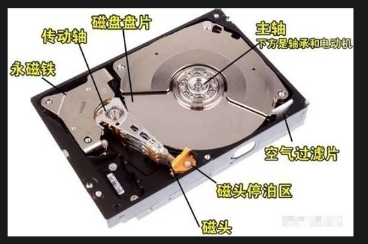

很多朋友只知道固态硬盘比机械硬盘快，但是却不知道固态硬盘为什么快？以及到底快在哪？

这里需要先了解一下机械硬盘的结构，机械硬盘采用磁性碟片来存储数据，这是机械硬盘的结构图。

储存数据的地方啊就是这个磁盘磁片，把数据写到磁盘磁片的结构啊就是这个磁头。写入以及读取数据的时候呢，
这个电机啊就让这个磁盘磁片转起来，然后磁头就会到达要写数据的扇区，把数据写进去。工作原理就有点像那种留声机工作原理。

机械硬盘是上下盘面同时进数据读取的。而且机械硬盘的旋转速度要远高于唱片（目前机械硬盘的常见转速是 7200 r/min），
所以机械硬盘在读取或写入数据时，非常害怕晃动和磕碰。另外，因为机械硬盘的超高转速，如果内部有灰尘，则会造成磁头或盘片的损坏，
所以机械硬盘内部是封闭的，如果不是在无尘环境下，则禁止拆开机械硬盘。

但是到底机械硬盘到底慢在哪里？其实慢就慢在它的这种工作方式。虽然看似7200转每分钟非常快了。
但是这依旧比不上采用电子方式的固态硬盘。这就有点像一辆马车与火车在比赛一样，完全没法比的。

但是机械硬盘的优点也是非常明显的，首先机械硬盘的储存的空间非常大而且它的寿命非常的长，
关键一点就是突然断电也不会导致数据的丢失。所以比较适合长时间保存一些数据。

另外还有一个区别就是机械硬盘与固态硬盘所使用的数据接口不一样，这就像是火车的路只能火车跑，而马车的路不一样什么都能跑。
这就导致火车的路不会堵车，而马车的路就不一样。

