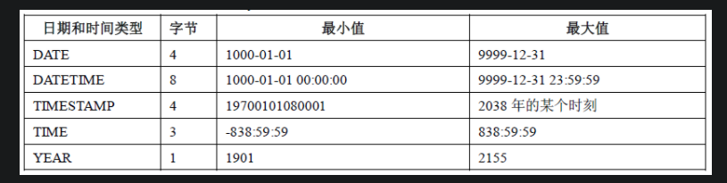
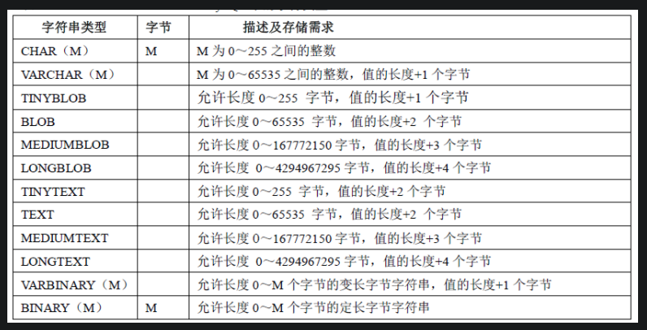

#B+树索引介绍
B+树索引的本质是B+树在数据库中的实现。但是B+树索引有一个特点是高扇出性，
因此在数据库中，B+树的高度一般在2到3层。也就是说查找某一键值的记录，
最多只需要2到3次IO开销。按磁盘每秒100次IO来计算，查询时间只需0.02到0.03秒。

#聚集索引和非聚集索引 
数据库中B+树索引分为聚集索引（clustered index）和非聚集索引（secondary index）.
这两种索引的共同点是内部都是B+树，高度都是平衡的。
区别: 
- 聚集索引(叶子节点存储着所有数据)
- 非聚集索引(叶子节点存储主键值或者数据物理位置)

#mysql字段类型占用字节大小
`
1千字节(kb) = 1024字节(b)  
1字节(b) = 8比特(bit)
`
数值类型字节大小占用:

时间日期类型字节大小占用:

字符串类型时间大小占用:

 

#计算索引树高度
InnoDB存储引擎默认一个数据页大小为16kb，非叶子节点存放（key，pointer），key为8个字节，pointer为4个字节;
即非叶子节点能存放[16kb/(8+4)b = 1365]左右的(key，pointer)，
而叶子节点如果一条数据大小为100字节，那一个叶子节点大约可存放[16kb/100b=160]条数据。
如果高度为3，则可存放数据为：1365 * 1365 * 160大约1亿多数据。
因此InnoDB存储引擎b+树的高度基本为2-3.

[问：B+Tree树高度一般多高？]
[答：所以B+Tree索引树高度一般不会超过3]