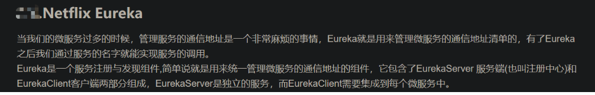
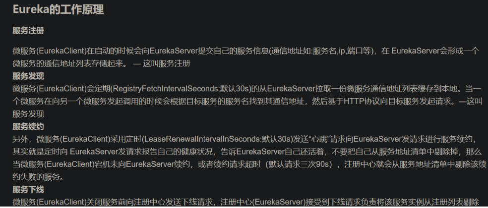
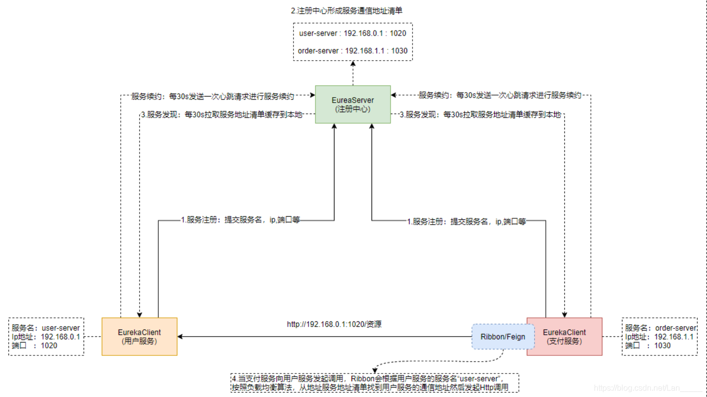
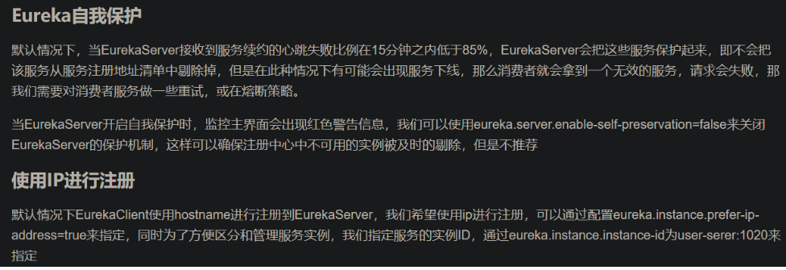

在eureka项目中看到一个配置：renewal-percent-threshold。并不是很理解，就此学习一下eureka的自我保护机制。

从这个配置说起，从字面角度来说就是心跳的百分比临界值。
我们都知道所有的服务都需要去向eureka服务器进行注册，并且维持心跳。这个字段大概率和这个心跳的频率有关。
先来看下eureka的自我保护机制：
一种针对网络异常波动的安全保护措施。eureka server在运行期间会去统计心跳失败的比例，在15分钟内是否低于85%。
若低的话，eureka会将实力保护起来，让这些实例不会过期。
当然若这个服务确实下线了的话，就会发生调用失败的问题，这里的话就是需要靠熔断机制来解决此问题了。

>划重点：85%其实就是renewal-percent-threshold的默认值。

再来看下eureka保护机制的实际计算过程：
打开eureka的地址，在右上角能看到两个字段，分别是Renews threshold，Renews（last min）
```
Renews threshold = count * 2 * renewal-percent-threshold
//count是服务的注册数量，2是因为每30s一个心跳。
```
也就是说在一分钟内renews（eureka收到的心跳）低于Renews threshold，就会进入自我保护机制。
