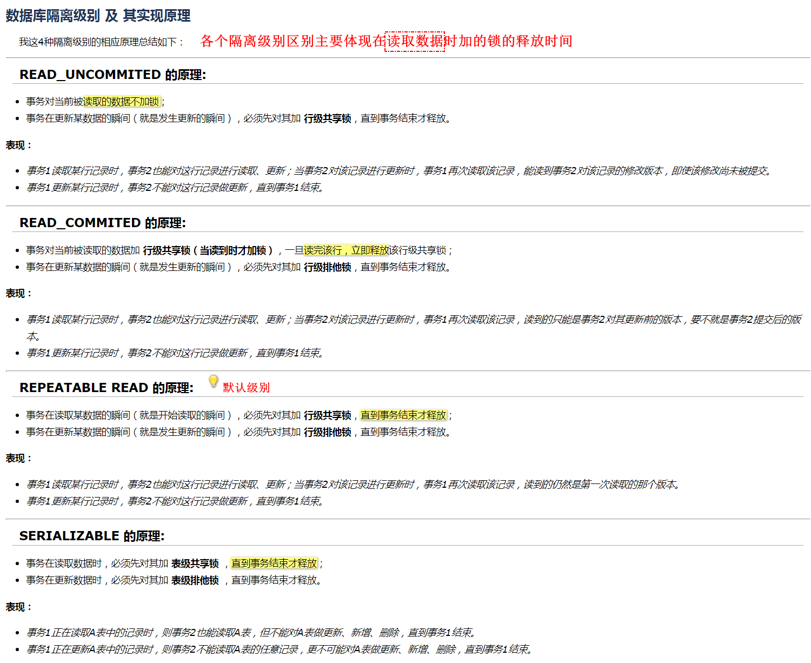

## 数据库隔离级别

### 1  事务

事务只是一个改变，是一些的操作集合；用专业的术语去解释，就是一个程序的执行单元；事务本身并不包含这四个特性，我们需要通过某些手段，尽可能让这个执行单元满足这四个特性，那么，我们就可以称它是一个事务，或者说是一个正确的，完美的事务。

### 2  四特性

- 原子性：满足原子操作单元，对数据的操作，要么全部执行，要么全部不执行。
- 一致性：事务开始和完成时，数据都必须保持一致。
- 隔离性：事务之间相互独立，中间状态对外部不可见。
- 持久性：数据的修改是永久性的，即使系统出现任何故障都能够保持。

### 3  隔离级别

#### 3.1  并发情况下事务引发的问题

> 一般情况下，多个单元操作（事务，这里的事务，并不是完美的事务）并发执行，会出现这么几个问题：

- 脏读：A事务还未提交，B事务就读到了A操作的结果。（破坏了隔离性）
- 不可重复读：A事务在本次事务中，对自己未操作过数据，进行多次读取，结果出现不一致或记录不存在的情况。（破坏了一致性，重点是update和delete）
- 幻读：A事务在本次事务中，先读取了一遍数据，发现数据不存在，过了一会，又读取了一遍，发现又有数据了。（破坏了一致性，重点是insert）

#### 3.2  解决（制定标准）

为了权衡『隔离』和『并发』的矛盾，ISO定义了4个事务隔离级别，每个级别隔离程度不同，允许出现的副作用也不同。

- 未提交读（read-uncommitted）：最低级别，基本只保证持久性；会出现脏读，不可重复读，幻读的问题。
- 已提交读（read-committed）：语句级别；会出现不可重复读，幻读的问题。
- 可重复读（repeatable-read）：事务级别；只会出现幻读问题。
- 串行化（serializable）：最高级别，也就是事务与事务完全串行化执行，无并发可言，性能低；但不会出现任何问题。

| 事务隔离级别                 | 脏读 | 不可重复读 | 幻读 |
| ---------------------------- | ---- | ---------- | ---- |
| 读未提交（read-uncommitted） | 会   | 会         | 会   |
| 不可重复读（read-committed） | -    | 会         | 会   |
| 可重复读（repeatable-read）  | -    | -          | 会   |
| 串行化（serializable）       | -    | -          | -    |

注意：这四个级别只是一个标准，各个数据库厂商，并不完全按照标准做的。

#### 3.2  实现（InnoDB）

- 锁机制：阻止其他事务对数据进行操作， 各个隔离级别主要体现在读取数据时加的锁的释放时机。

  - RU：事务读取时不加锁

  - RC：事务读取时加行级共享锁（读到才加锁），一旦读完，立刻释放（并不是事务结束）。

  - RR：事务读取时加行级共享锁，直到事务结束时，才会释放。

  - SE：事务读取时加表级共享锁，直到事务结束时，才会释放。

  > 其他还有一些细节不同，主要就是这些

- MVCC机制：生成一个数据快照，并用这个快照来提供一定级别的一致性读取，也称为多版本数据控制。

  - 实际就是『版本控制』加『读写分离』思想，主要用作于RC和RR级别。
  -  这里面就太细了，主要涉及到事务原理和索引，就不讲了，因为！第一：面试要求讲MVCC的原理比较少，第二：主要我讲了你必然记不住，这也是为什么问的比较少的原因了，因为面试官自己肯定是记不住的。除非像在下一样，每天每天的看，感觉忘了就看。一般人也做不到。如果面试被问到了，肯定是面试官上班无聊，刷到一些软文，自己看了看，觉得写得很好，随口就问了。但不得不说，现在的技术软文，写得，都是什么大便。还有随便吹一下自己的经验，说一些心得，点击收藏就好几万的。我哪天也开始做这种视频，不做技术讲解了。直接做吹牛逼的视频，天天给观众讲道理，灌鸡汤。攒个几十万粉丝再说。但是，好吧，在下不是这种人。这行没别的，就一个字，学，讲多了都是P话。

### 4  结构图

