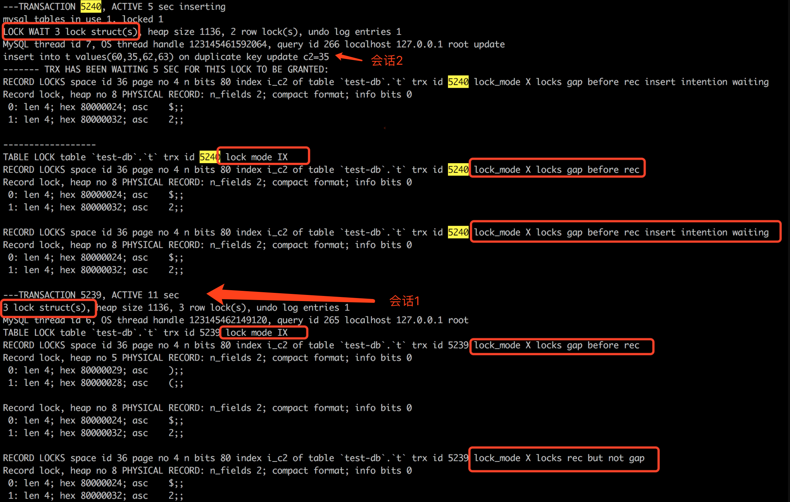
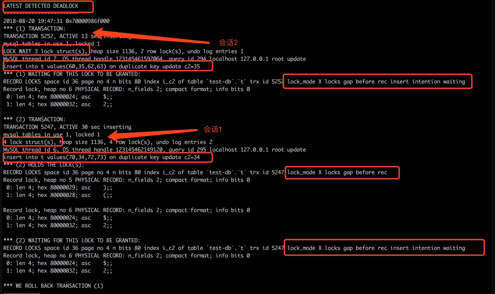

问题背景：Deadlock found when trying to get lock; try restarting transaction

# 重现过程：
```sql
create table t
(
    c1    int primary key,
    c2    int,
    c3    int,
    c4    int,
    unique index i_c2(c2),
    index i_c3(c3)
);
insert into t
values (10, 11, 12, 13),
       (20, 21, 22, 23),
       (30, 31, 32, 33),
       (40, 41, 42, 43);

-- 表名t，c1列为主键，c2列为唯一索引，c3列为普通索引
-- 数据库隔离级别：RR
-- 数据库版本：mysql 5.7.21
```
```
场景说明：批量插入场景，多个会话同时插入，每一个会话插入多条数据。
场景描述：在唯一索引c2的间隙（31，41）插入3条不同记录。会话1先插入1条c2=36，会话2接着插入1条c2=35，最后会话1插入1条c2=34。这3次操作插入的值都不一样
```


用Navicat工具，打开AB两个窗口，

#会话1：
```sql
start transaction;
insert into t values(50,36,52,53) on duplicate key update c2=36;
```

#会话2：
```sql
start transaction;
insert into t values(60,35,62,63) on duplicate key update c2=35;
```

#这个时候会话2阻塞了，我们可以查看一下锁信息，另外开启一个会话3：
```sql
show engine innodb status;
```



#注释会话1原来的语句，并在会话1执行。
```sql
insert into t values(70,34,72,73) on duplicate key update c2=34;
```

可以看到最新的1条死锁信息，就是我们刚刚产生的死锁

#我们切换到会话3
```sql
show engine innodb status;
```



~~~
分析：
说在前面：第一张图命名为图1，第二张图命名为图2

一. 查看图1，我们知道insert会上3把锁
1.1 表锁IX，这个没有任何问题，插入期间，表结构不能变
1.2 间隙锁（lock_model X locks gap before rec）,这个比较难理解。我看了半天原因也没看明白想。（如果insert语句命中了记录，比如已经存在c2=36的记录，这里会是next-key lock）如果你想细细研究，参考如下文章https://juejin.im/entry/5adca48df265da0b9c1037c8
    总之，因为mysql5.6有一个bug，mysql5.7为了修复这个bug，引入了这把锁
1.3 插入意向锁（lock_mode X locks gap before rec insert intention waiting）,插入的时候，一般都有这把锁。目的是，告诉别人我要在某某区间插入数据了，避免幻读(RC隔离级别不会加，这里我80%的把握，如果RC隔离级别会加，还望大神指正)。对意向锁感兴趣，可以参考如下文章：http://yeshaoting.cn/article/database/mysql%20insert%E9%94%81%E6%9C%BA%E5%88%B6/
1.4 还有最后一个红框，是lock_mode X locks rec but not gap 这个是插入记录之后的记录锁。
这里捋一下：
会话1插入记录的时候，申请表锁IX，gap锁，插入意向锁。插入成功后，释放了插入意向锁，增加了插入记录的记录锁（rec lock）（理论上锁在事务未提交，不应该释放，但是看截图是释放了的，估计记录锁也能够保证插入意向锁的功能）
会话2插入记录的时候，申请表锁IX，gap锁。然后申请意向锁发生了等待，因为会话1持有了gap锁。

二. 查看图2，我们可以看到死锁原因
会话2总共3把锁，等待插入意向锁，另外持有的2把锁没有显示，经过图1的分析，可以猜到是表锁IX和间隙锁gap lock。
会话1持有3把锁，等待1把锁。持有表锁IX，gap锁，第一条插入记录的record lock锁（第一条记录申请的插入意向锁已经释放）
会话1插入第三条记录的时候，先申请gap锁，发现已经持有，成功（我猜的）。申请插入意向锁发生了等待，因为会话2持有gap锁，阻塞了插入意向锁。
总之，死锁产生原因是，会话2的插入意向锁等待会话1释放gap锁，会话1插入意向锁也在等待会话2释放gap锁。

三. 如何规避
隔离级别调整为RC，读提交，在这种场景不会有gap锁（并不是说RC隔离级别不会有gap锁）。前提是binlog同步机制是基于row，而不是基于statement。这一块不熟悉的，可以参考
https://www.jianshu.com/p/c16686b35807
这里多说一句，建议大家都把隔离级别调整为RC，然后binlog基于row。这样能够减少很多死锁的发生（因为死锁一般是因为gap锁，而RR隔离级别很多场景都会有gap锁。而RC隔离级别只有很少场景存在gap锁）
改写为先select 如果存在update，不存在insert


