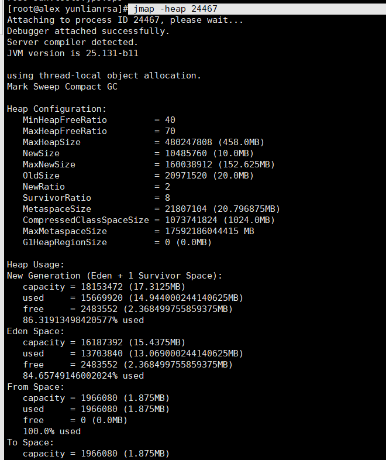

#查看jvm内存分配及使用情况
```shell script
jmap -heap [pid]
```



jmap是用来生成堆dump文件和查看堆相关的各类信息的命令，例如查看finalize执行队列，heap的详细信息和使用情况。
命令格式：
- jmap [option] <pid> (连接正在执行的进程)
- jmap [option] <executable <core> (连接一个core文件)
- jmap [option] [server_id@]<remote server IP or hostname> (链接远程服务器)

option参数解释：
 <none> to print same info as Solaris pmap
- heap 打印java heap摘要
- histo[:live] 打印堆中的java对象统计信息
- clstats 打印类加载器统计信息
- finalizerinfo 打印在f-queue中等待执行finalizer方法的对象
- dump:<dump-options> 生成java堆的dump文件
　　　　　　dump-options:
　　　　　　live 只转储存活的对象，如果没有指定则转储所有对象
　　　　　　format=b 二进制格式
　　　　　　file=<file> 转储文件到 <file>

-F 强制选项

常用示例：
jmap -dump:live,format=b,file=dump.hprof 11666

输出：
Dumping heap to /dump.hprof ...
Heap dump file created

这个命令是要把java堆中的存活对象信息转储到dump.hprof文件
jmap -finalizerinfo 11666

输出：
Attaching to process ID 11666, please wait...
Debugger attached successfully.
Server compiler detected.
JVM version is 24.71-b01
Number of objects pending for finalization: 0
输出结果的含义为当前没有在等待执行finalizer方法的对象

jmap -heap 11666
输出堆的详细信息

输出：
Attaching to process ID 11666, please wait...
Debugger attached successfully.
Server compiler detected.
JVM version is 25.25-b02

using thread-local object allocation.
Parallel GC with 4 thread(s)

Heap Configuration: //堆内存初始化配置
   MinHeapFreeRatio         = 0 //对应jvm启动参数-XX:MinHeapFreeRatio设置JVM堆最小空闲比率(default 40)
   MaxHeapFreeRatio         = 100 //对应jvm启动参数 -XX:MaxHeapFreeRatio设置JVM堆最大空闲比率(default 70)
   MaxHeapSize              = 1073741824 (1024.0MB) //对应jvm启动参数-XX:MaxHeapSize=设置JVM堆的最大大小
   NewSize                  = 22020096 (21.0MB) //对应jvm启动参数-XX:NewSize=设置JVM堆的新生代的默认大小
   MaxNewSize               = 357564416 (341.0MB) //对应jvm启动参数-XX:MaxNewSize=设置JVM堆的新生代的最大大小
   OldSize                  = 45088768 (43.0MB) //对应jvm启动参数-XX:OldSize=<value>:设置JVM堆的老年代的大小
   NewRatio                 = 2 //对应jvm启动参数-XX:NewRatio=:新生代和老生代的大小比率
   SurvivorRatio            = 8 //对应jvm启动参数-XX:SurvivorRatio=设置新生代中Eden区与Survivor区的大小比值
   MetaspaceSize            = 21807104 (20.796875MB) // 元数据区大小
   CompressedClassSpaceSize = 1073741824 (1024.0MB) //类压缩空间大小
   MaxMetaspaceSize         = 17592186044415 MB //元数据区最大大小
   G1HeapRegionSize         = 0 (0.0MB) //G1垃圾收集器每个Region大小

Heap Usage: //堆内存使用情况
PS Young Generation 
Eden Space: //Eden区内存分布
   capacity = 17825792 (17.0MB) //Eden区总容量
   used     = 12704088 (12.115562438964844MB) //Eden区已使用
   free     = 5121704 (4.884437561035156MB) //Eden区剩余容量
   71.26801434685203% used //Eden区使用比率
From Space: //其中一个Survivor区的内存分布
   capacity = 2097152 (2.0MB)
   used     = 1703936 (1.625MB)
   free     = 393216 (0.375MB)
   81.25% used
To Space: //另一个Survivor区的内存分布
   capacity = 2097152 (2.0MB)
   used     = 0 (0.0MB)
   free     = 2097152 (2.0MB)
   0.0% used
PS Old Generation
   capacity = 52428800 (50.0MB) //老年代容量
   used     = 28325712 (27.013504028320312MB) //老年代已使用
   free     = 24103088 (22.986495971679688MB) //老年代空闲
   54.027008056640625% used //老年代使用比率

15884 interned Strings occupying 2075304 bytes.


#jmap -histo:live 11666 | more
输出存活对象统计信息

输出：
num     #instances         #bytes  class name
----------------------------------------------
1:         46608        1111232  java.lang.String
2:          6919         734516  java.lang.Class
3:          4787         536164  java.net.SocksSocketImpl
4:         15935         497100  java.util.concurrent.ConcurrentHashMap$Node
5:         28561         436016  java.lang.Object

