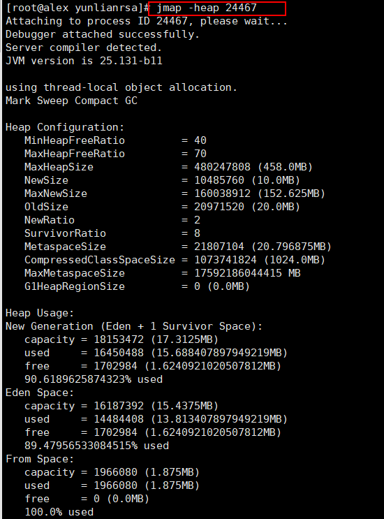
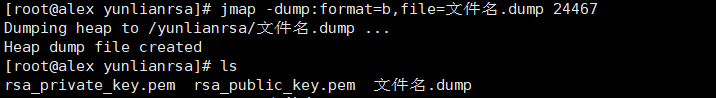
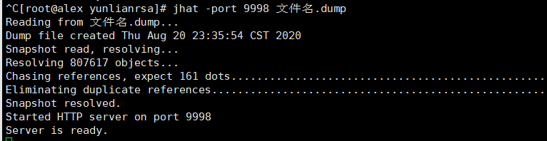

##方法1 事先设置好参数，在出现内存溢出时，会自动的保存堆信息
```
OOM一般都是出现了内存泄露，须要查看OOM时候的jvm堆的快照，假设配置了-XX:+HeapDumpOnOutOfMemoryError, 
在发生OOM的时候会在-XX:HeapDumpPath指定的路径下生成堆的dump文件（例如：java_pid27893.hprof）。
结合MAT，能够对dump文件进行分析。查找出发生OOM的原因.
```

-----------------------------------------------------------------------------------------------

##方法2 
```
jmap命令可以获得运行中的jvm的堆的快照，从而可以离线分析堆，以检查内存泄漏，检查一些严重影响性能的大对象的创建，检查系统中什么对象最多，各种对象所占内存的大小等等
```

1：jmap -heap PID      [打印heap的概要信息，GC使用的算法，heap的配置及wise heap的使用情况]


2：jmap -dump:format=b,file=文件名.hprof PID   [生成堆内存dump文件]


3.可以使用jhat查看，这种方式不太好懂，命令如下：
jhat -port 8081 文件名.hprof     [将开启一个http服务端口为8081，可以通过浏览器查看堆信息]  


4.jhat的替代方案；使用更强大的MAT堆分析工具，eclipse的mat插件。

