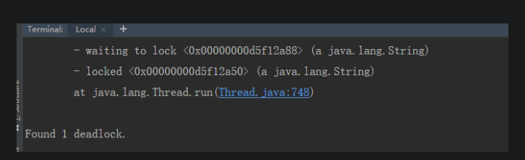

#第一步  列出所有java进程  -l参数可以显示具体的执行类
```shell script
jps -l

输出:
11232 com.test.test
29488 sun.tools.jps.Jps
```

#第二步  jstack pid 就能查到死锁的位置
```shell script
jstack [pid]  > 1.txt 
```

#得到结果：死锁问题展示



###线程状态分析
值得关注的线程状态有：
```
① 死锁：Deadlock（重点关注）
② 执行中：Runnable
③ 等待资源：Waiting on condition（重点关注）
④ 等待获取监视器：Waiting on monitor entry（重点关注）
⑤ 暂停：Suspended
⑥ 对象等待中：Object.wait() 或 TIMED_WAITING
⑦ 阻塞：Blocked（重点关注）
⑧ 停止：Parked
```

