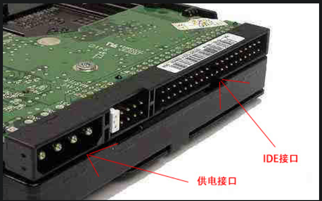
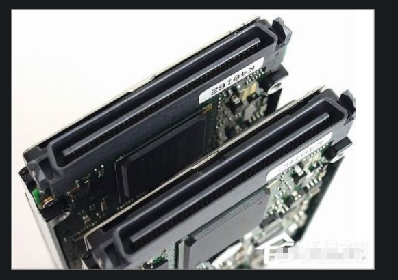
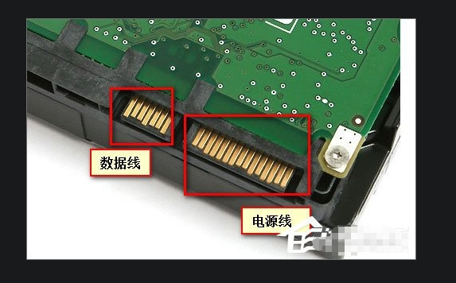
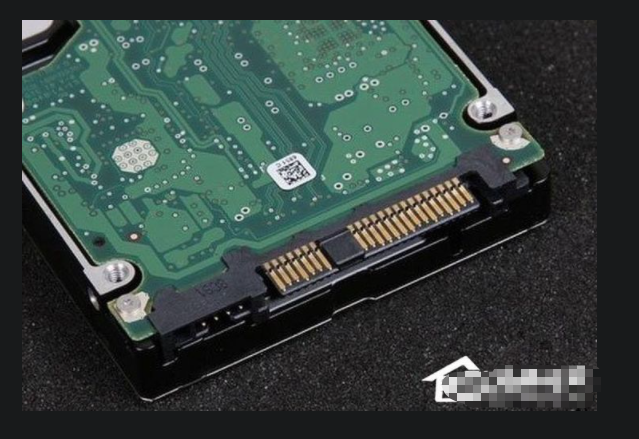
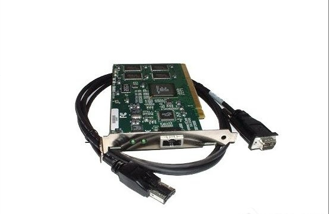

硬盘接口有几种？硬盘接口决定着硬盘与计算机之间的连接速度，所以硬盘接口是大家不能小觑的元件。
为了大家更好的掌握硬盘接口相关知识，今天将给大家详细解说硬盘接口的类型。
硬盘接口介绍：
　　 硬盘接口是硬盘与主机系统间的连接部件，作用是在硬盘缓存和主机内存之间传输数据。
    不同的硬盘接口决定着硬盘与计算机之间的连接速度，在整个系统中，硬盘接口的优劣直接影响着程序运行快慢和系统性能好坏。
　　 从整体上，硬盘接口类型可分为IDE、SATA、SCSI 、SAS和光纤通道五种，IDE接口硬盘多用于家用产品中，
    也有部分应用于服务器，SCSI接口的硬盘则主要应用于服务器市场，而光纤通道只在高端服务器上，价格昂贵。
    SATA是种新生的硬盘接口类型，还正处于市场普及阶段，在家用市场中有着广泛的前景。下面详细介绍。

硬盘接口类型图解：

#一、IDE接口的硬盘
其英文名称：Integrated Drive Electronics，常见的2.5英寸IDE硬盘接口它的本意是指把“硬盘控制器”与“盘体”集成在一起的硬盘驱动器。
IDE代表着硬盘的一种类型，但在实际的应用中，人们也习惯用IDE来称呼最早出现IDE类型硬盘ATA-1，这种类型的接口随着接口技术的发展已经被淘汰了，
而其后发展分支出更多类型的硬盘接口，比如ATA、Ultra ATA、DMA、Ultra DMA等接口都属于IDE硬盘。
其特点为：价格低廉，兼容性强，性价比高，数据传输慢，不支持热插拔等等。具体展示如下图所示。

#二、SCSI接口类型
其英文名称为：Small Computer System Interface。SCSI并不是专门为硬盘设计的接口，是一种广泛应用于小型机上的高速数据传输技术。
SCSI接口具有应用范围广、多任务、带宽大、CPU占用率低，以及热插拔等优点，但较高的价格使得它很难如IDE硬盘般普及，
因此SCSI硬盘主要应用于中、高端服务器和高档工作站中。
其特点为：传输速率高、读写性能好、可连接多个设备、可支持热插拔，但是价格相对来说比较贵。具体如下图所示。

#三、SATA接口类型
其英文名称为：Serial Advanced Technology Attachment。使用SATA（Serial ATA）口的硬盘又叫串口硬盘，
是未来PC机硬盘的趋势。Serial ATA采用串行连接方式，串行ATA总线使用嵌入式时钟信号，具备了更强的纠错能力，
与以往相比其最大的区别在于能对传输指令（不仅仅是数据）进行检查，如果发现错误会自动矫正，这在很大程度上提高了数据传输的可靠性。
串行接口还具有结构简单、支持热插拔的优点。具体如下图所示。

#四、SAS接口类型
其英文名称为：Serial Attached SCSI。其可以向下兼容SATA。具体来说，二者的兼容性主要体现在物理层和协议层的兼容。
在物理层，SAS接口和SATA接口完全兼容，SATA硬盘可以直接使用在SAS的环境中，从接口标准上而言，SATA是SAS的一个子标准，
因此SAS控制器可以直接操控SATA硬盘，但是SAS却不能直接使用在SATA的环境中，
因为SATA控制器并不能对SAS硬盘进行控制；在协议层，SAS由3种类型协议组成，根据连接的不同设备使用相应的协议进行数据传输。
其中串行SCSI协议（SSP）用于传输SCSI命令；SCSI管理协议（SMP）用于对连接设备的维护和管理；SATA通道协议（STP）用于SAS和SATA之间数据的传输。
因此在这3种协议的配合下，SAS可以和SATA以及部分SCSI设备无缝结合。其传输速率比SATA要快很多。具体如下展示。

#五、光纤通道
其为英文字母Fibre Channel的缩写。其最初设计也不是为了硬盘设计开发的接口，
是专门为网络系统设计的，但随着存储系统对速度的需求，才逐渐应用到硬盘系统中。
光纤通道的主要特性有：热插拔性、高速带宽、远程连接、连接设备数量大等。具体展示如下图。

