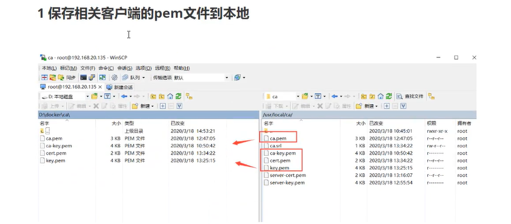
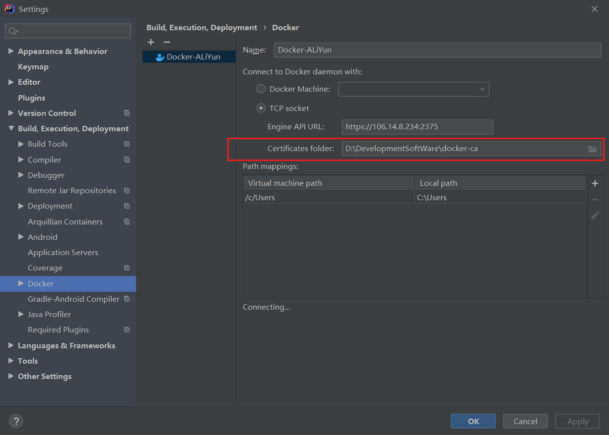

#1.创建目录用于保存私钥和公钥
mkdir -p /usr/local/ca


#2.在该目录生成私钥
openssl genrsa -aes256 -out ca-key.pem 4096

-要求输入ca密码:
输入 306881085
验证 306881085


#3.再在该目录生成公钥
openssl req -new -x509 -days 365 -key ca-key.pem -sha256 -out ca.pem

-要求输入密码：
输入 306881085
-要求输入国家：
输入 cn
-要求输入省份：
输入 hn
-要求输入城市：
输入 ny
-要求输入组织名：
输入 lll
-要求输入组织单元名：
输入 lll
-要求输入主机名：
输入 wl
-要去输入email地址：
输入 306881085@qq.com
[公钥已在当前目录生成]


#4.生成server-key.pem
openssl genrsa -out server-key.pem 4069


#5.CA来签署公钥
由于TLS连接可以通过IP地址和DNS名称进行，所以在创建证书时需要指定IP地址，例如，允许使用10.10.10.20和127.0.0.1进行连接
```
openssl req -subj "/CN=$HOST" -sha256 -new -key server-key.pem -out server.csr
比如
openssl req -subj "/CN=192.168.20.135" -sha256 -new -key server-key.pem -out server.csr
或
openssl req -subj "/CN=www.javaqq.com" -sha256 -new -key server-key.pem -out server.csr
```
openssl req -subj "/CN=106.14.8.234" -sha256 -new -key server-key.pem -out server.csr


#6.配置白名单
1.允许指定IP可以连接到服务器的docker，可以配置IP，用逗号分隔开
2.因为已经是ssl连接，所以我推荐配置0.0.0.0，也就是所有IP都可以连接（单只有拥有证书的才可以连接成功）
这样配置好之后，公司其他人也可以使用
```
如果填写的是IP地址 命令如下 echo subjectAltName = IP:$HOST,IP:0.0.0.0 >> extfile.cnf
如果填写的是域名   命令如下 echo subjectAltName = DNS:$HOST,IP:0.0.0.0 >> extfile.cnf
```
上面的$HOST依旧是你服务器的外网IP或者域名，请自行替换
echo subjectAltName = IP:106.14.8.234,IP:0.0.0.0 >> extfile.cnf


#7.执行命令
将Docker守护程序秘钥的扩展使用属性设置为仅用于服务器验证
echo extendedKeyUsage = serverAuth >> extfile.cnf


#8.生成签名证书
openssl x509 -req -days 365 -sha256 -in server.csr -CA ca.pem -CAkey ca-key.pem \
-CAcreateserial -out server-cert.pem -extfile extfile.cnf

-要求输入密码：
输入 306881085  [要与前面一致]


#9.生成客户端的key.pem
openssl genrsa -out key.pem 4069
openssl req -subj '/CN=client' -new -key key.pem -out client.csr


#10.要使密钥适合客户端身份验证
创建扩展配置文件：
echo extendedKeyUsage = clientAuth >> extfile.cnf
echo extendedKeyUsage = clientAuth >> extfile-client.cnf


#11.现在，生成签名证书
openssl x509 -req -days 365 -sha256 -in client.csr -CA ca.pem -CAkey ca-key.pem \
-CAcreateserial -out cert.pem -extfile extfile-client.cnf
生成cert.pem，需要输入前面设置的密码


#12.删除不需要的文件，两个证书签名请求
生成cert.pem和server-cert之后，您可以安全的删除两个证书签名请求和扩展配置文件：
rm -v client.csr server.csr extfile.cnf extfile-client.cnf


#13.可修改权限
要保护您的密钥免受意外损坏，请删除其写入权限，要使他们只能被您读取，更改文件模式
chmod -v 0400 ca-key.pem key.pem server-key.pem
证书可以是对外可读的，删除写入权限以防止意外损坏
chmod -v 0444 ca.pem server-key.pem cert.pem


#14.归集服务器证书
cp server-*.pem /etc/docker/
cp ca.pem /etc/docker/

#15.修改docker配置
使docker守护程序仅接收来自提供CA信任的证书的客户端的连接
vim /lib/systemd/system/docker.service

将
ExecStart=/usr/bin/dockerd
替换为
ExecStart=/usr/bin/dockerd --tlsverify --tlscacert=/usr/local/ca/ca.pem --tlscert=/usr/local/ca/server-cert.pem --tlskey=/usr/local/ca/server-key.pem -H tcp://0.0.0.0:2375 -H unix:///var/run/docker.sock

#16.重新加载daemon并重启docker
systemctl daemon-reload
systemctl restart docker

#17.开放2375端口
/sbin/iptables -I INPUT -p tcp --dport 2375 -j ACCEPT

#18 重启Docker
systemctl restart docker

#19 保存linux上生成的证书到本地
请看图


#20 完成idea设置



