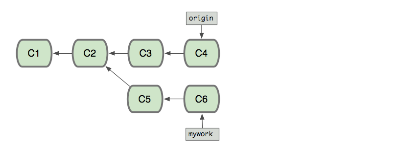
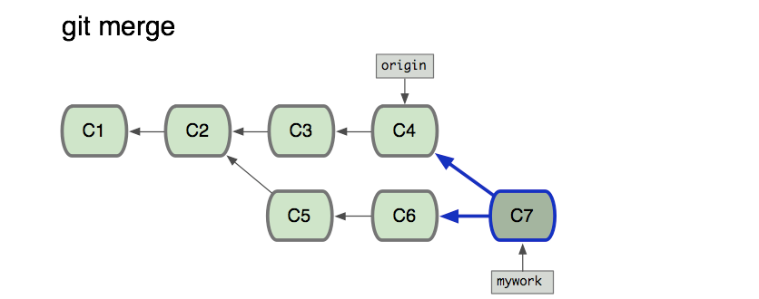
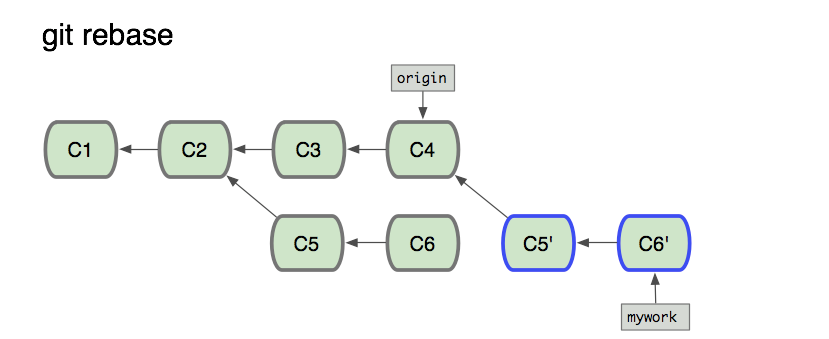
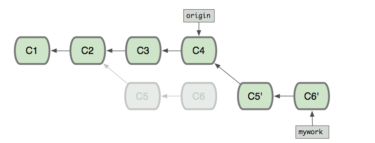

##
最初：

如果使用merge命令：

如果使用rebase命令：

--------------------------------------------------------
#补充git rebase interactive 交互用法

##1.修改当前分支的提交历史
git rebase -i commitId[可以用git log命令在提交日志，找一个]

##2.先把master分支，以rebase方式拿过来，并修改当前分支提交历史
git rebase -i master