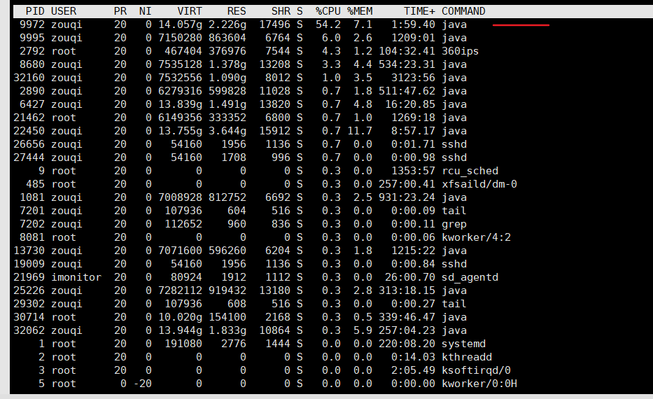

##1.先使用top命令找到占用CPU高的java进程的[pid] 
```shell script
top
```



##2.执行命令，将该进程对应的所有线程都列出来，看看那个线程的占用CPU最多，然后将这个线程的pid转换为16进制
##### 通过top -H -p pid可以查看该进程下各个线程的cpu使用情况； 
```shell script
top -H -p [CPU占用高的pid]
```


##3.使用jstack 占用CPU高的java进程的[pid]  命令导出栈信息
#####通过top命令定位到cpu占用率较高的线程之后，继续使用jstack pid命令查看当前java进程的堆栈状态
```shell script
jstack [pid]
```


##4.根据16进制的线程pid 在栈信息中找到对应的描述信息 【java的栈信息中的线程id是用16进制表示的】
```shell script
cat stack.txt | grep "16进制pid" -C 10
```


jstack命令生成的thread dump信息包含了JVM中所有存活的线程，为了分析指定线程，必须找出对应线程的调用栈，应该如何找？
在top命令中，已经获取到了占用cpu资源较高的线程pid，将该pid转成16进制的值，在thread dump中每个线程都有一个nid，
找到对应的nid即可；隔段时间再执行一次stack命令获取thread dump，区分两份dump是否有差别，在nid=0x246c的线程调用栈中，发现该线程一直在执行JstackCase类第33行的calculate方法，得到这个信息，就可以检查对应的代码是否有问题。
